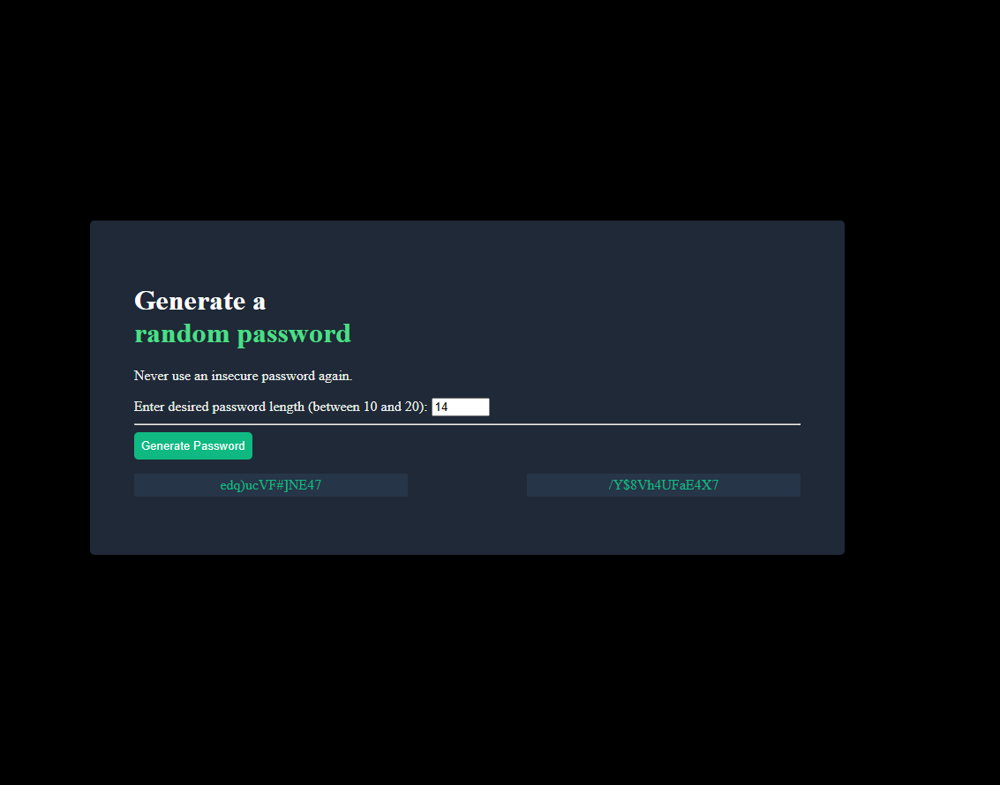

# Password-Generator-Scrimba-Solo
This is the password generator solo project from the full stack developer path scrimba course. 

## Live site and Preview
Here is a preview of the live site:

View the [live site here!](https://mrjgee.github.io/Password-Generator-Scrimba-Solo/)

## My Process and tools

### Languages and tools

* Javascript
* HTML 
* CSS
* VScode

### Built with

* Desktop first workflow
* Custom CSS Properties 
* CSS Flexbox
* Vanilla Javascript

### Resources

* [Free online course](https://www.youtube.com/watch?v=LzMnsfqjzkA)
* [Figma File](https://www.figma.com/design/NEj9JDycMjF3XKXq7swoc9/Random-Password-Generator--New-version-?node-id=0-1&p=f&t=OEfeRnHV4RusRoWM-0)
* [Scrimba site](https://scrimba.com/fullstack-path-c0fullstack)